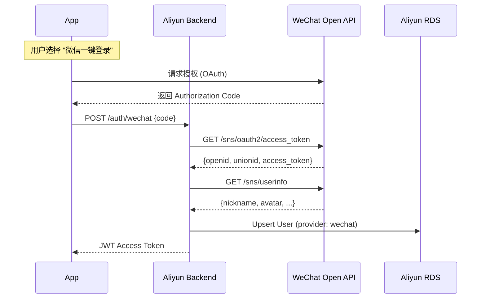

# FutureCraft 全球化技术实施方案 (Gemini 方案)

> **版本**: v1.0 (Dual-Region Strategy)
> **日期**: 2025-12-16
> **核心目标**: 海外为主 (GCP)，国内为辅 (Aliyun)，实现全球青少年覆盖。

---

## 1. 总体战略：双区域混合架构 (Dual-Region Hybrid)

为了兼顾全球用户的最佳体验与中国大陆的合规及网络现实，我们采取 **"两套基建，统一核心"** 的策略。

| 区域 | 部署位置 | 核心云厂商 | 核心服务 | 数据归属 |
| :--- | :--- | :--- | :--- | :--- |
| **Global (主)** | **东京 (Tokyo)** | **GCP** (Google Cloud) | NestJS + Cloud SQL + Gemini | 独立 (GDPR/Global) |
| **China (辅)** | **杭州/上海** | **Aliyun** (阿里云) | NestJS + RDS + Proxy | 独立 (中国境内) |

### 架构核心逻辑
1.  **代码统一**: 95% 的 NestJS 后端代码是通用的。通过 `REGION_CODE` (CN/GLOBAL) 环境变量在运行时切换差异逻辑（如支付、登录）。
2.  **AI 统一**: 中国区不自建大模型，而是通过 **"专线代理"** 调用东京的 Gemini 接口，保持核心游戏体验一致。
3.  **端侧区分**: iOS App 依据用户网络环境或手动选择区域，连接不同 API 端点。

---

## 2. 详细系统架构图

```mermaid
graph TD
    subgraph "客户端 (iOS Native)"
        UserGlobal[海外用户]
        UserCN[国内用户]
    end

    subgraph "Global Region (GCP Tokyo)"
        IngressG[Cloud Load Balancing]
        ServiceG[Cloud Run (NestJS)]
        DB_G[(Cloud SQL PG)]
        RedisG[(Memorystore)]
        SecretG[Secret Manager]
        Gemini[Gemini Pro API]
        
        IngressG --> ServiceG
        ServiceG --> DB_G
        ServiceG --> RedisG
        ServiceG --> Gemini
    end

    subgraph "China Region (Aliyun Hangzhou)"
        IngressCN[SLB 负载均衡]
        ServiceCN[ECS/ACK (NestJS)]
        DB_CN[(RDS PostgreSQL)]
        RedisCN[(Aliyun Redis)]
        
        IngressCN --> ServiceCN
        ServiceCN --> DB_CN
        ServiceCN --> RedisCN
    end

    %% 跨国链路
    UserGlobal -->|HTTPS| IngressG
    UserCN -->|HTTPS| IngressCN
    
    %% AI 代理链路 (关键)
    ServiceCN -.->|VPN/Proxy Tunnel| ServiceG
    Note_Proxy[CN 后端通过加密隧道\n请求 Global 后端转发 Gemini]
```

---

## 3. 技术栈差异对比表

| 模块 | Global (GCP) | China (Aliyun) | 适配方案 |
| :--- | :--- | :--- | :--- |
| **计算服务** | Cloud Run (Serverless) | ECS 或 AppStack | Docker 镜像通用，部署配置不同 |
| **数据库** | Cloud SQL (PostgreSQL) | RDS for PostgreSQL | Schema 完全一致 (Prisma) |
| **身份认证** | **Apple ID** + Email + Guest | **WeChat** + Apple + Mobile | Passport 策略模式切换 |
| **支付系统** | **Apple IAP** (StoreKit 2) | **Apple IAP** (同上) | IAP 全球通用，后端无需太大改动 |
| **敏感词过滤** | 可选 (宽松) | **必须** (阿里云绿网/文本审核) | CN 环境开启中间件拦截 |
| **对象存储** | **GCP Storage** (已实现) | **Aliyun OSS** (预留接口) | `FileStorageService` 抽象接口 |
| **多语言** | **En / Zh-Hans / Zh-Hant** | **En / Zh-Hans / Zh-Hant** | 统一 i18n JSON 资源包 |

---

## 4. 关键业务流程

### 4.1 身份认证 (Authentication)

国内环境必须支持微信登录，以适应本土习惯。



### 4.2 AI 差异化服务设计 (Gemini vs Qwen)

为了彻底解决合规与网络稳定性问题，中国区将**不使用**代理调用 Gemini，而是直接接入国内头部合规大模型。

**策略**:
*   **Global**: 使用 **Google Gemini Pro** (原生体验，多模态能力强)。
*   **China**: 使用 **阿里云 Qwen (通义千问) Max** 或 **DeepSeek** (中文理解更强，完全合规，无需翻墙)。

**适配层设计 (Adapter Pattern)**:
后端 `GeminiService` 将重构为 `AIService` 接口，下设两个实现：
1.  `GoogleGeminiProvider`: 适配 Google GenAI SDK。
2.  `AliyunQwenProvider`: 适配阿里云 DashScope SDK。

**ASCII 示意图**:
```text
[CN User] 
    │ (1) Chat Request
    ▼
[Aliyun Backend] ──(2) Check Sensitive Words (Aliyun Green)──▶ [Pass]
    │                                              
    │ (3) Call Aliyun DashScope API (Qwen-Max)
    ▼
[Aliyun Qwen Service] 
    │ (4) Response: "宇航员需要..."
    ▼
[Aliyun Backend] ◀──(5) Return Data
    │
    ▼
[CN User] (6) Display Typewriter Effect
```
*注：Prompts 需维护两套微调版本，以保证“人设”在不同模型下的一致性。*

---

## 5. 移动端 UI 适配 (ASCII Prototype)

App 启动时，根据 IP 或用户选择决定连接哪个 Region。

```text
+-----------------------------------+
|          FUTURE CRAFT             |
|                                   |
|       [ logo placeholder ]        |
|                                   |
|    Select Your Region / 地区      |
|                                   |
|  [ 🌍 Global / International ]    |
|      (Supports Apple/Email)       |
|                                   |
|  [ 🇨🇳 China Mainland / 中国 ]     |
|      (Supports WeChat/Mobile)     |
|                                   |
+-----------------------------------+
           │ User Taps CN
           ▼
+-----------------------------------+
|        Login (China Mode)         |
|                                   |
|      [ (icon) WeChat Login ]      |
|      [ (icon) Apple ID     ]      |
|                                   |
|      -----------------------      |
|      Or use Mobile Number         |
|      [ +86 ] [ Phone Num ]        |
|      [ Verify Code       ]        |
|                                   |
|    [v] Agree to User Agreement    |
+-----------------------------------+
```

---

## 6. 实施路线图 (Global First)

鉴于资源有限，采取 **"先海外，后国内"** 的严格分步走策略。

**Phase 1: Global MVP (前 1-2 个月)**
*   **重点**: 跑通 GCP + Gemini + Cloud SQL + iOS App。
*   **发布**: App Store (非中国区)。
*   **动作**: 
    *   仅部署 GCP 东京节点。
    *   App 仅暴露 Global 登录入口。
    *   验证核心玩法 (Soul Scan, Sim)。

**Phase 2: China Expansion (待 Phase 1 稳定后)**
*   **重点**: 部署阿里云节点 + 接入 Qwen + 微信登录。
*   **发布**: App Store 中国区。
*   **动作**: 
    1.  购买/部署 Aliyun 资源。
    2.  实现 `AIService` 的 Qwen 适配器。
    3.  接入微信登录与阿里云绿网审核。


---

## 7. 待确认决策点

1.  **域名策略**: Global 使用 `api.futurecraft.world`，CN 是否使用独立备案域名 (e.g., `api.futurecraft.cn`)？ (建议分开，避免 DNS 污染)。
2.  **账号互通**: Global 和 CN 的账号数据是否隔离？(强烈建议**物理隔离**，避免合规麻烦)。
3.  **微信支付**: 虽然 iOS IAP 涵盖了虚拟服务，但若未来涉及实物或非 App 内使用的服务，是否需要接微信支付？(初期仅 IAP 即可)。
