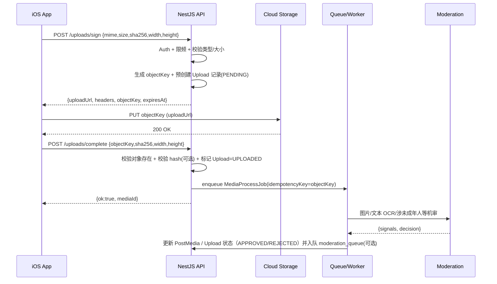
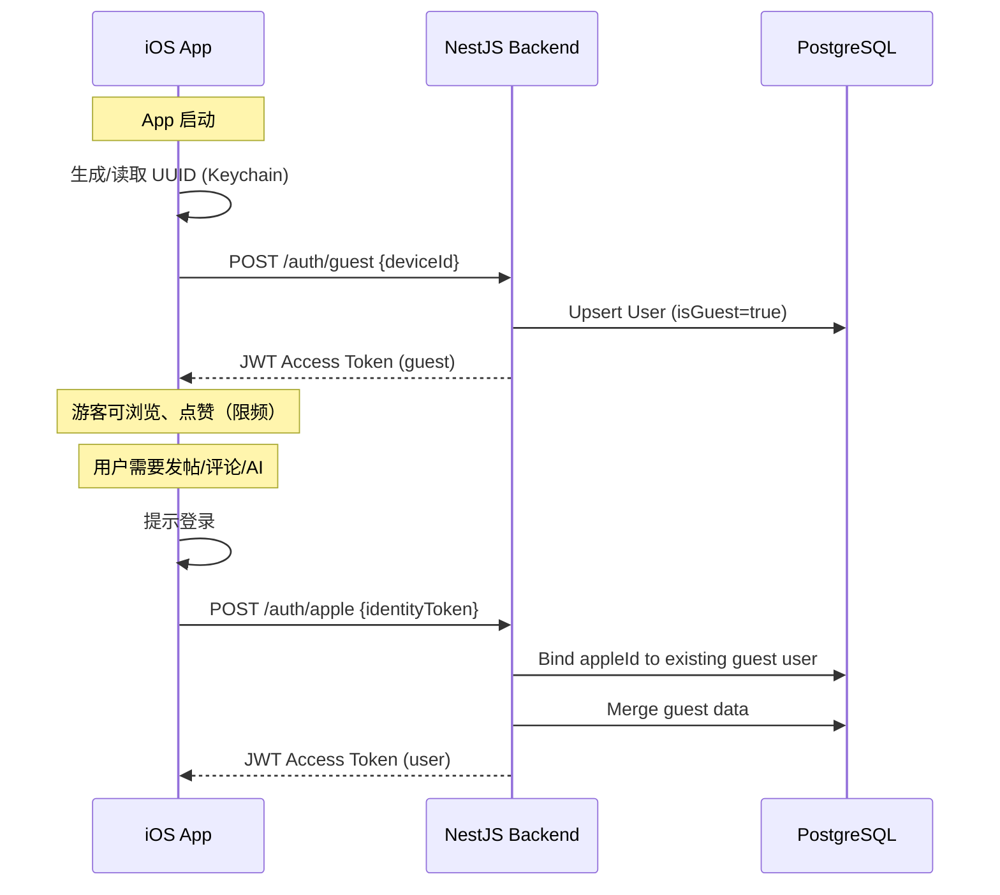
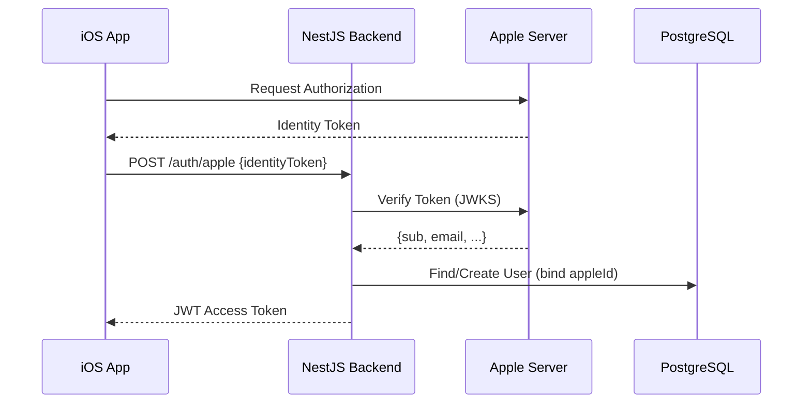
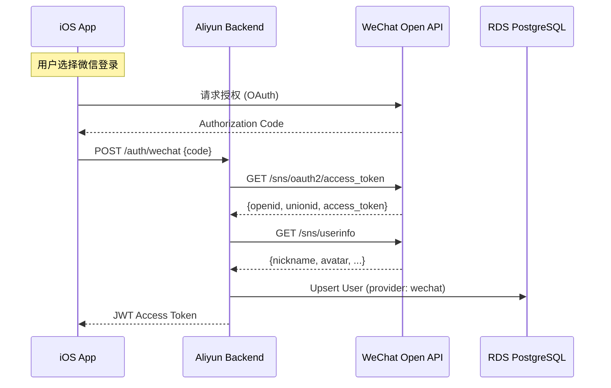
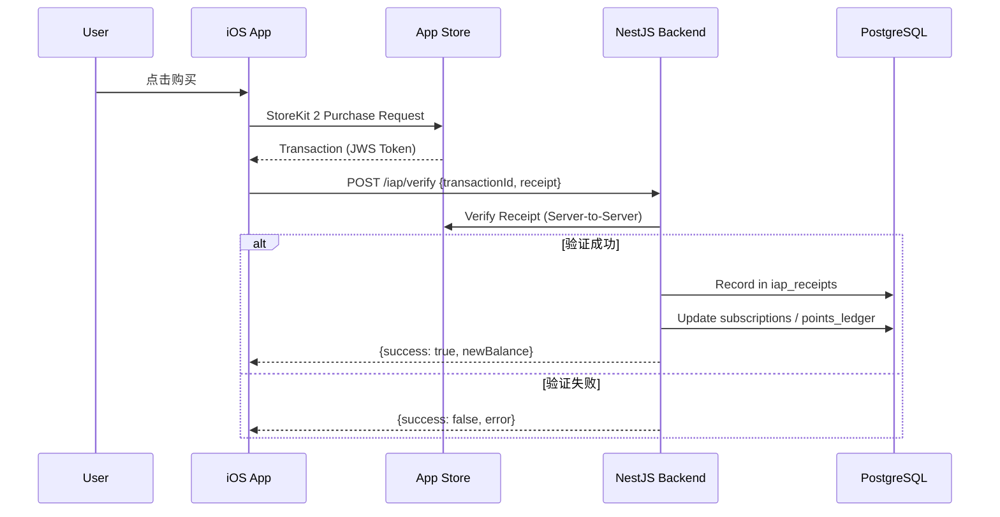

# FutureCraft 技术白皮书 v3.0

<div align="center">

## FutureCraft - AI 驱动的职业探索 RPG + UGC 社区平台

**版本**: v3.0 (Unified Dual-Region Architecture)  
**最后更新**: 2025年12月  
**核心技术栈**: NestJS + (GCP/Aliyun) + SwiftUI + PostgreSQL  

</div>

---

> 本白皮书整合了 FutureCraft RPG 核心功能与 UGC 社区功能，采用双区域架构（Global: GCP 东京 / China: Aliyun 杭州），AI 服务使用 Gemini 2.5 Pro/Flash（海外）+ Qwen（中国区）。

## 目录

1. [核心决策摘要](#1-核心决策摘要)
2. [系统架构设计](#2-系统架构设计)
3. [产品模块A：FutureCraft RPG 核心](#3-产品模块afuturecraft-rpg-核心)
4. [产品模块B：UGC 社区](#4-产品模块bugc-社区)
5. [身份认证系统](#5-身份认证系统)
6. [商业化系统](#6-商业化系统)
7. [AI 服务设计](#7-ai-服务设计)
8. [数据库设计](#8-数据库设计)
9. [API 设计](#9-api-设计)
10. [审核与风控](#10-审核与风控)
11. [移动端实现 (iOS)](#11-移动端实现-ios)
12. [基础设施与运维](#12-基础设施与运维)
13. [合规与安全](#13-合规与安全)
14. [实施路线图](#14-实施路线图)

---

## 1. 核心决策摘要

基于产品规划与技术讨论，本项目已确认采纳以下决策：

| 决策维度 | 最终方案 | 关键考量 |
| :--- | :--- | :--- |
| **移动端** | **iOS 原生 (SwiftUI)** | 极致体验，完美支持 Apple IAP/Sign In |
| **后端框架** | **NestJS (TypeScript)** | 类型安全，模块化架构，易于维护 |
| **数据库** | **PostgreSQL (Prisma ORM)** | 稳定性与托管服务 |
| **云基础设施** | **Global: GCP 东京 / China: Aliyun 杭州** | 全球可用 + 中国合规（数据域物理隔离） |
| **边缘与路由** | **Global: Cloudflare / CN: 阿里云 CDN+WAF（独立入口）** | 中国区不依赖 Cloudflare；按区域分流 |
| **AI Provider** | **Global: Gemini 2.5 Pro + Flash / CN: Qwen** | Pro 处理复杂任务，Flash 处理简单任务 |
| **登录方式** | **游客 + Apple + Google + 微信(CN) + 邮箱** | 多 Provider 支持，游客可体验 |
| **支付方式** | **Apple IAP (订阅 + 积分包)** | iOS 必须使用 IAP |
| **订阅价格** | **$19.99/月 (含 1,000 Credits)** | 主流价格心智 |
| **积分包** | **$4.99/250, $9.99/600, $19.99/1,400** | 补充 AI 用量 |
| **年龄门槛** | **Global: 13+ / CN: 14+** | COPPA + 中国未成年人保护法 |
| **实名认证** | **不要求** | 简化注册流程 |
| **私聊功能** | **不提供** | 降低骚扰/诱导风险 |
| **推荐算法** | **不做** | 时间排序/话题/人工精选 |
| **外链策略** | **先检后发，每条最多 1 条** | 安全优先 |
| **账号注销** | **UGC 匿名化保留** | 审计留痕 |
| **区域切换** | **允许切换（数据不跨区迁移）** | 双域物理隔离；切换仅改变入口/数据域 |

---

## 2. 系统架构设计

### 2.1 双区域云原生架构

采用 **Global/CN 双域物理隔离** 架构：
- Global：Cloudflare 作为入口（CDN/WAF/路由），GCP Serverless 为主
- China：使用阿里云 CDN+WAF 与独立域名入口，中国区所有流量与数据在阿里云闭环
- 同代码不同部署；用户级数据不互通

```mermaid
graph TD
    subgraph Clients [Clients]
        iOS[iOS App SwiftUI]
    end

    subgraph EdgeLayer [Edge Layer]
        CF[Cloudflare CDN/WAF (Global)]
        AC[Aliyun CDN+WAF (China)]
    end

    subgraph GlobalRegion [Global Region: GCP Tokyo]
        GLB[Cloud Load Balancing]
        GService[Cloud Run NestJS]
        GDB[(Cloud SQL PostgreSQL)]
        GRedis[(Memorystore Redis)]
        GSecret[Secret Manager]
        GStorage[Cloud Storage]
        GeminiPro[Gemini 2.5 Pro]
        GeminiFlash[Gemini 2.5 Flash]
    end

    subgraph ChinaRegion [China Region: Aliyun Hangzhou]
        CSLB[SLB]
        CService[ECS/FC NestJS]
        CDB[(RDS PostgreSQL)]
        CRedis[(Aliyun Redis)]
        COSS[OSS]
        Qwen[Qwen API]
        AliyunGreen[Aliyun Green]
    end

    iOS -->|HTTPS Global| CF
    iOS -->|HTTPS China| AC
    CF -->|Global Traffic| GLB
    AC -->|China Traffic| CSLB

    GLB --> GService
    GService --> GDB
    GService --> GRedis
    GService --> GSecret
    GService --> GStorage
    GService --> GeminiPro
    GService --> GeminiFlash

    CSLB --> CService
    CService --> CDB
    CService --> CRedis
    CService --> COSS
    CService --> Qwen
    CService --> AliyunGreen
```

### 2.2 区域隔离原则

| 项 | Global (GCP) | China (Aliyun) |
|---|---|---|
| 计算服务 | Cloud Run (Serverless) | ECS / Function Compute |
| 数据库 | Cloud SQL PostgreSQL | RDS PostgreSQL |
| 缓存 | Memorystore Redis | Aliyun Redis |
| 对象存储 | Cloud Storage | OSS |
| AI 服务 | Gemini 2.5 Pro/Flash | Qwen (通义千问) |
| 内容审核 | Perspective/Hive | Aliyun Green (绿网) |
| 数据流 | 不与 CN 互通用户级数据 | 不与 Global 互通用户级数据 |
| 域名 | `api.futurecraft.world` | `api.futurecraft.cn` (需备案) |

### 2.3 区域切换策略（允许切换）

区域切换仅影响“请求入口与数据域”，不做跨区数据同步/迁移：
- App 首次启动展示 `Region Selector`，用户可在设置中切换 Global/CN
- 切换后：使用对应区域 API Base URL；**必须重新登录**（各区域 Token 不通用）
- 用户体验：若在 A 区登录并产生数据，切换到 B 区后视为“另一套账号/数据域”（明确提示“数据不互通”）
- 设备游客：每个区域各自维护一份 guest 会话（同一 deviceId 可在不同区域生成不同 user 记录）
- 账号唯一性（默认）：**同一邮箱/手机号不可在 Global 与 CN 重复注册**；绑定时若发现跨区已存在则提示用户切回原区域登录

### 2.4 服务分层设计

```text
┌─────────────────────────────────────────────────────────────────────────┐
│                         iOS Client (SwiftUI)                            │
│      [AuthManager] [IAPManager] [NetworkLayer] [RegionSelector]         │
└─────────────────────────────────┬───────────────────────────────────────┘
                                  │ REST API
                                  ▼
┌─────────────────────────────────────────────────────────────────────────┐
│                      NestJS API Gateway (Cloud Run / ECS)               │
├──────────┬──────────┬──────────┬──────────┬──────────┬──────────────────┤
│   Auth   │   User   │   Game   │   UGC    │    AI    │     Billing      │
│  Guards  │ Profile  │ RPG Core │ Content  │ Gateway  │   IAP/Credits    │
├──────────┴──────────┴──────────┴──────────┴──────────┴──────────────────┤
│                      Service Layer (Business Logic)                     │
│   [AIService] [CreditSystem] [ModerationService] [ContentService]       │
├─────────────────────────────────────────────────────────────────────────┤
│                      Data Access Layer (Prisma ORM)                     │
└─────────────────────────────────────────────────────────────────────────┘
```

### 2.5 后端模块划分

| 模块 | 职责 | 主要存储 |
|---|---|---|
| Auth | 游客会话、登录、绑定第三方、Token | Postgres + Redis |
| Users | 资料、分龄、状态（禁言/封禁） | Postgres |
| Game | Soul Scan、Simulation、Tutor、Boss Battle | Postgres |
| Content | 帖子、媒体、话题、可见性/状态 | Postgres + Object Storage |
| Interaction | 评论、点赞、收藏 | Postgres + Redis (热计数) |
| Moderation | 机审、人审、处置、申诉、审计 | Postgres + Queue |
| Billing | 订阅/IAP 校验、积分台账、配额 | Postgres |
| AI Gateway | Gemini/Qwen 代理、配额扣减、日志脱敏、风控 | Postgres + Redis |
| Admin | 审核/运营控制台 API | Postgres |

---

## 3. 产品模块A：FutureCraft RPG 核心

### 3.1 功能概述

FutureCraft RPG 是一个 AI 驱动的职业探索游戏，帮助青少年通过游戏化方式了解职业。

| 功能 | 描述 | AI 模型 |
|---|---|---|
| **Soul Scan** | 用户填写兴趣/专业，AI 生成 RPG 属性和职业原型 | Gemini 2.5 Flash |
| **Multiverse Map** | 多元宇宙职业地图，展示 AI 匹配的职业路径 | - |
| **AI 主播播报** | TTS 语音讲解职业信息 | Gemini 2.5 Flash TTS |
| **Life Simulation** | 第一天工作 RPG 模拟，选择-结果机制 | Gemini 2.5 Flash |
| **Skill Tree** | AI 生成学习资源树 | Gemini 2.5 Flash |
| **AI Tutor** | 苏格拉底式 AI 导师对话 | Gemini 2.5 Pro |
| **Boss Battle** | 模拟面试，高压测试模式 | Gemini 2.5 Pro |

### 3.2 RPG 属性系统

```typescript
interface RPGStats {
  intelligence: number;  // 智力 (0-100)
  creativity: number;    // 创造力 (0-100)
  charisma: number;      // 魅力 (0-100)
  stamina: number;       // 耐力 (0-100)
  tech: number;          // 技术力 (0-100)
}

interface UserProfile {
  name: string;
  major: string;
  hobbies: string[];
  hiddenTalent: string;
  rpgStats?: RPGStats;
  archetype?: string;  // e.g., "Cyber Mystic", "Data Mercenary"
}
```

### 3.3 游戏流程

```text
[ Soul Scan (Form) ]
       │
       ▼
[ Analysis Result (Map) ] ──▶ [ Job Detail ]
       │                       │ Day In Life
       │                       │ Pitfalls
       │                       └──────┬─────
       │                              │
       ▼                              ▼
[ Simulation Game ] ◀────────────────┘
│ Scenario A/B/C │
└───────┬────────┘
        │
        ▼
[ Skill Tree ] ──▶ [ AI Tutor / Boss Battle ]
```

### 3.4 AI 模型选择策略

| 功能 | 模型选择 | 理由 |
|---|---|---|
| Soul Scan | Gemini 2.5 Flash | 结构化输出，成本优化 |
| Simulation | Gemini 2.5 Flash | 快速响应，场景生成 |
| Skill Tree | Gemini 2.5 Flash | 资源推荐，批量生成 |
| AI Tutor | Gemini 2.5 Pro | 深度对话，苏格拉底式引导 |
| Boss Battle | Gemini 2.5 Pro | 复杂推理，压力测试 |
| TTS 播报 | Gemini 2.5 Flash TTS | 语音合成 |

---

## 4. 产品模块B：UGC 社区

### 4.1 功能概述

UGC 社区是一个面向青少年的内容分享平台，采用时间排序（不做算法推荐）。

| 功能 | 游客 | 登录用户 | 说明 |
|---|:---:|:---:|---|
| 浏览 Feed | ✅ | ✅ | 最新/话题/精选 三个 Tab |
| 帖子详情 | ✅ | ✅ | 展示帖子、媒体、评论 |
| 点赞 | ✅ | ✅ | 游客点赞需强限频/反刷 |
| 评论列表 | ✅(只读) | ✅ | 二级回复 |
| 发表评论 | ❌ | ✅ | 支持外链（先检后发） |
| 发帖 | ❌ | ✅ | 文本+图；发布前规范提示 |
| 举报 | ❌ | ✅ | 对帖子/评论/用户举报 |
| 收藏 | ❌ | ✅ | 个人收藏夹 |
| AI 问答 | ❌ | ✅ | 需订阅/积分 |
| 拉黑/屏蔽用户 | ❌ | ✅ | 不再互相可见（见 10. 风控策略） |
| 静音/不看该用户 | ❌ | ✅ | 不推荐/不展示其内容（时间线过滤） |
| 未成年人保护模式 | ✅ | ✅ | 更严格过滤与更保守的展示策略 |
| 敏感内容开关 | ✅ | ✅ | 默认关闭；**未成年人不可开启**（见 13.1.1） |

### 4.2 信息架构

```text
App
 ├─ Feed (最新/话题/精选)
 │   ├─ Post Detail
 │   │   └─ Comments
 │   └─ Topic List
 ├─ Create Post (登录)
 ├─ RPG Module
 │   ├─ Soul Scan
 │   ├─ Multiverse Map
 │   ├─ Simulation
 │   ├─ Skill Tree
 │   └─ AI Tutor
 ├─ Profile
 │   ├─ My Posts
 │   ├─ Bookmarks (登录)
 │   └─ Settings
 └─ Paywall (订阅/积分包)
```

### 4.3 角色与权限

| 角色 | 能力 | 备注 |
|---|---|---|
| 游客 | 浏览、点赞 | 低权重 + 强限频 + 风控命中不计入 |
| 注册用户 | 发帖、评论、收藏、举报、订阅、AI 问答 | 风控限频/禁言/封禁 |
| 审核员 | 审核队列、处置、备注、申诉处理 | 全量审计 |
| 运营 | 话题/精选/置顶/公告、活动配置 | 不直接做封禁 |
| 管理员 | 权限、系统配置、审计、供应商配置 | 最小人数持有 |

### 4.4 外链安全策略

| 阶段 | 动作 | 实现 |
|---|---|---|
| 提交时 | 提取 URL、规范化、限制数量（每条≤1） | 正则 + URL parser |
| 同步检测 | 解析跳转链、分类（成人/博彩/诈骗/短链） | Safe Browsing / 自建黑名单 |
| 呈现 | `✅已检测` 或 `⛔已屏蔽` | 先检通过才允许发布 |
| 处置 | 高危直接替换为"链接已屏蔽" | 审核队列可复核 |

### 4.5 用户关系：拉黑/静音（Block/Mute）

- Block（拉黑/屏蔽）：双方互相不可见（帖子、评论、资料页），同时阻断 @ 提及与任何未来潜在私信能力
- Mute（静音/不看）：仅对当前用户生效，不展示对方内容与通知，不影响对方看到你
- 审核与风控：被大量拉黑可作为风控信号（非直接处罚依据）

### 4.6 媒体上传链路（客户端直传对象存储）

采用“客户端直传 + 后端签名 + 回调入库 + 异步审核/处理”的标准链路，避免大文件经由 API 转发。

#### 4.6.1 Global（GCS）时序



#### 4.6.2 China（OSS）时序

流程一致，仅存储/审核供应商替换为 OSS + Aliyun Green（图片审核）。

#### 4.6.3 约束与安全控制（MVP 建议）

- 文件类型：仅图片（`image/jpeg`,`image/png`,`image/webp`），拒绝 GIF/视频（后续再开）
- 大小限制：单图 ≤ 10MB（可配），单帖最多 9 图（可配）
- 命名策略：`media/{userId}/{yyyy}/{mm}/{cuid}-{sha256}.{ext}`，避免遍历猜测
- 访问策略（默认）：上传桶/发布桶均私有；对外展示使用短期签名 URL（Global: Cloud Storage Signed URL；CN: OSS Signed URL）
- 缓存策略：签名 URL TTL 15-60 分钟（可配）；客户端按需刷新；CDN 缓存依赖对象 key 不变与 immutable 资源
- 处理策略：异步生成缩略图/多尺寸、提取 hash、EXIF 清理、重复上传去重（可选）
- 状态策略：媒体未审核通过前，帖子可进入 `PENDING` 或“仅自己可见”

### 4.7 Feed 分页与排序（Cursor）

为避免重复/丢失，Feed 统一采用稳定游标：
- 排序键：`(createdAt DESC, id DESC)`
- Cursor 编码：`base64("{createdAtISO}:{id}")`
- 查询规则：`WHERE (createdAt, id) < (cursorCreatedAt, cursorId)`（与排序方向一致）
- Tab 规则：
  - `latest`：按发布时间倒序
  - `featured`：`featuredRank ASC, createdAt DESC, id DESC`（精选优先，时间兜底）
  - `topic`：在话题维度按发布时间倒序（可选叠加置顶）

---

## 5. 身份认证系统

### 5.1 支持的登录方式

| Provider | Global | China | 优先级 |
|---|:---:|:---:|---|
| 游客模式 | ✅ | ✅ | P0 |
| Apple Sign In | ✅ | ✅ | P0 |
| Google Sign In | ✅ | ❌ | P1 |
| 微信登录 | ❌ | ✅ | P0 (CN) |
| 邮箱登录 | ✅ | ✅ | P1 |

### 5.2 游客模式流程



### 5.3 Apple 登录流程



### 5.4 微信登录流程 (中国区)



### 5.5 年龄门槛处理

| 场景 | Global | 中国区 |
|---|---|---|
| 低于门槛年龄 | `<13` 阻断注册；仅浏览 | `<14` 阻断注册；仅浏览 |
| 游客 | 允许浏览+点赞 | 允许浏览+点赞 |
| 登录后年龄缺失 | 引导填写出生年份 | 同上（必须） |

### 5.6 Token、会话与游客合并（MVP 默认）

#### 5.6.1 Token 形态

- Access Token：JWT（15 分钟），承载 `userId/region/tier` 等最小必要声明
- Refresh Token：随机串（30 天），仅存储哈希（不可逆）+ 绑定设备信息
- 刷新策略：Refresh Token **轮换**（refresh 时签发新 refresh，旧 refresh 立即作废）

#### 5.6.2 多设备登录

- 允许多设备同时在线（默认最多 5 个活跃 refresh，会话超过上限则按最旧淘汰）
- 支持“登出当前设备”与“登出所有设备”

#### 5.6.3 游客绑定与数据合并

游客升级登录（Apple/Google/Email/WeChat）时，将 guest 用户的数据归并到登录用户：
- 方式：将 guest 侧产生的数据行 `userId` 迁移到登录用户（或合并后删除 guest）
- 去重：依赖唯一约束（例如 `Reaction @@unique([userId,targetType,targetId,type])`）避免重复
- 冲突处理：同一对象的点赞/收藏以“存在即保留”为准；计数以实际数据重算（或异步校正）

#### 5.6.4 跨区账号唯一性（邮箱/手机号）

为降低重复账号与未成年人治理成本，采用“全局唯一”的身份策略：
- 邮箱/手机号在 Global 与 CN **不可重复注册/绑定**
- 实现：对 `UserIdentity` 增加 `globalIdentityKey = sha256(provider + ":" + normalizedIdentifier)` 并设唯一索引（两区各自实现同逻辑）
- 绑定冲突：提示用户“该邮箱/手机号已在另一地区注册，请切换地区登录”；不提供跨区迁移

---

## 6. 商业化系统

### 6.1 定价策略

#### 订阅 ($19.99/月)

| 项 | 值 |
|---|---|
| 月度 AI 额度 | 1,000 Credits/月 |
| 计量单位 | 1 Credit = 1,000 tokens |
| 扣减方式 | `credits = ceil((input_tokens + output_tokens) / 1000)` |
| 试用期 | 7 天（可配置） |
| 超额处理 | 引导购买积分包 |
| 单日上限 | `ceil(monthly_credits / 30 * 2)` = 67 Credits/天 |

#### 积分包 (IAP Consumable)

| 档位 | Credits | 单价 |
|---:|---:|---|
| $4.99 | 250 | 入门补量 |
| $9.99 | 600 | 主销 |
| $19.99 | 1,400 | 大包更划算 |

### 6.2 用户类型与权益

| 用户类型 | 月度订阅发放 | 额外购买 | 说明 |
|---|---|---|---|
| 游客 | 0 | 不可购买 | 仅浏览/体验 |
| 登录未订阅 | 0（可配置试用） | 可购买 | 积分包补充 |
| 订阅会员 | 1,000 Credits/月 | 可购买 | 每月刷新；叠加积分包 |

### 6.3 IAP 购买流程



### 6.3.1 订阅状态一致性（App Store Server Notifications V2）

为保证订阅与积分台账长期一致，接入 **App Store Server Notifications V2**：
- 后端提供 `POST /iap/notifications` 接收通知（校验签名与去重）
- 覆盖事件：续费成功/失败、取消、到期、退款/撤销、试用期变化、升降级、宽限期等
- 处理原则：通知驱动“订阅事实状态”落库；积分发放/回收写入 `points_ledger`；所有操作幂等

### 6.4 Credits 扣减逻辑

```text
[用户发起 AI 请求]
    │
    ▼
[检查登录 + 订阅状态]
    │
    ▼
[计算可用 credits = 订阅月额度剩余 + 购买余额]
    │
    ├─► (不足) [引导购买积分包/升级]
    │
    ▼
[检查单日上限: 当日已用 + 本次预估 <= daily_cap]
    │
    ├─► (超限) [提示明日继续]
    │
    ▼
[预留 credits（避免竞态）]
    │
    ▼
[调用 AI Provider]
    │
    ▼
[按实际 tokens 结算扣减]
    │
    ▼
[写入 ai_usage + points_ledger]
```

### 6.5 Credits 发放、结算与退款/撤销（MVP 默认）

为避免“订阅 credits 与购买 credits 混用导致退款难处理”，余额拆分为两部分：
- `subscription_remaining`：当前订阅周期剩余额度（到期清零，不结转）
- `purchased_balance`：积分包余额（长期有效，除非退款/撤销）

#### 6.5.1 发放时点

- 订阅首次购买成功：立即发放当期 `subscription_remaining = monthly_credits`
- 每个续费账期开始：重置 `subscription_remaining = monthly_credits`（上一周期剩余清零）
- 积分包购买成功：增加 `purchased_balance += credits`

#### 6.5.2 扣减顺序

优先扣减 `subscription_remaining`，不足部分再扣 `purchased_balance`。

#### 6.5.3 退款/撤销处理（由 Server Notifications 驱动）

- 订阅退款/撤销：将 `subscription_remaining` 置 0，并将订阅状态更新为 `EXPIRED/REVOKED`
- 积分包退款/撤销：从 `purchased_balance` 中扣回对应 credits，最低扣到 0（不产生负数）
- 台账幂等：`points_ledger` 的发放/回收记录以 `refType+refId` 唯一（`originalTransactionId+periodStart` 等）保证重复通知不会重复记账

---

## 7. AI 服务设计

### 7.1 Provider 抽象层

后端实现统一的 `AIService` 接口，下设多个 Provider 实现：

```typescript
interface LLMProvider {
  generate(messages: Message[], params: GenerateParams): Promise<{
    text: string;
    usage: { inputTokens: number; outputTokens: number };
  }>;
}

// 实现
class GoogleGeminiProvider implements LLMProvider { ... }
class AliyunQwenProvider implements LLMProvider { ... }
```

### 7.2 模型路由策略

| 条件 | 模型选择 |
|---|---|
| Global + 简单任务 (Soul Scan, Sim, Skill Tree) | Gemini 2.5 Flash |
| Global + 复杂任务 (Tutor, Boss Battle) | Gemini 2.5 Pro |
| China 区 | Qwen (通义千问) |

### 7.3 AI 请求链路

| 步骤 | 后端动作 | 关键控制 |
|---|---|---|
| 1 | 鉴权（必须登录） | 订阅/credits 检查 |
| 2 | 输入过滤 | PII 提示、敏感主题预分类 |
| 3 | 配额扣减预估 | 预留 credits |
| 4 | Provider 代理调用 | 超时/重试/熔断 |
| 5 | 输出后过滤 | 违规输出二次拦截 |
| 6 | 结算扣减 | 按 tokens 实扣 |
| 7 | 反馈闭环 | 👍/👎/举报 → 审核队列 |

### 7.4 风控与限制

| 项 | 默认值 |
|---|---|
| 单次最大 tokens | input + output ≤ 8,000 |
| 单日 credits 上限 | ceil(monthly_credits / 30 * 2) |
| 并发 | 每用户 1-2 个请求 |
| 频控 | N requests/min（按风险评分动态） |
| 违规主题 | 成人/赌博/毒品/诈骗/暴力/仇恨/违法教程 |
| 自伤 | 返回"求助/安全资源"模板 |

### 7.5 数据存储策略

| 数据 | 是否保存 | 建议 |
|---|:---:|---|
| 原始问题/回答 | ❌（默认） | 默认不保存；仅保存脱敏摘要/哈希用于排障 |
| 命中风控的原文 | ✅（有限） | 仅在命中高风险/申诉需要时加密留存，设置短保留期（见 13.2） |
| 用量记录 | ✅ | `ai_usage` 表 |
| 反馈/举报 | ✅ | 进入 `reports` / `moderation_queue` |

---

## 8. 数据库设计

### 8.1 核心 Schema (Prisma)

```prisma
// ============================================
// 用户体系
// ============================================

model User {
  id                String    @id @default(cuid())
  
  // 基础信息
  isGuest           Boolean   @default(false)
  locale            String    @default("en")      // en, zh-Hans, zh-Hant
  region            String    @default("GLOBAL")  // GLOBAL, CN
  
  // 年龄与安全
  birthYear         Int?
  ageBucket         String?   // "13-17", "18-24", "25+"
  safetyLevel       Int       @default(0)         // 风控评分
  
  // 账号状态
  status            String    @default("ACTIVE")  // ACTIVE, SUSPENDED, BANNED
  bannedUntil       DateTime?
  bannedReason      String?
  
  // 订阅与积分 (反规范化快速读取)
  creditBalance     Int       @default(0)
  subscriptionTier  String    @default("FREE")    // FREE, PRO
  subscriptionEndsAt DateTime?
  dailyCreditsUsed  Int       @default(0)
  lastDailyReset    DateTime  @default(now())
  
  // 删除与匿名化
  deletedAt         DateTime?
  anonymizedAt      DateTime?
  
  createdAt         DateTime  @default(now())
  updatedAt         DateTime  @updatedAt
  
  // Relations
  identities        UserIdentity[]
  sessions          Session[]
  profile           Profile?         @relation("UserProfile")
  rpgProfiles       UserProfile[]
  gameSessions      GameSession[]
  posts             Post[]
  comments          Comment[]
  reactions         Reaction[]
  reports           Report[]
  subscriptions     Subscription[]
  pointsLedger      PointsLedger[]
  aiUsage           AiUsage[]
}

model UserIdentity {
  id              String   @id @default(cuid())
  userId          String
  user            User     @relation(fields: [userId], references: [id])
  
  provider        String   // "apple", "google", "wechat", "email"
  providerUserId  String   // Apple sub, Google sub, WeChat openid
  email           String?
  
  createdAt       DateTime @default(now())
  
  @@unique([provider, providerUserId])
  @@index([userId])
}

model Session {
  id                String   @id @default(cuid())
  userId            String?
  user              User?    @relation(fields: [userId], references: [id])
  
  guestId           String?  // 游客设备 ID
  refreshTokenHash  String
  expiresAt         DateTime
  deviceInfo        Json?    // { platform, version, deviceId }
  
  createdAt         DateTime @default(now())
  
  @@index([userId])
  @@index([guestId])
}

model Profile {
  id          String   @id @default(cuid())
  userId      String   @unique
  user        User     @relation("UserProfile", fields: [userId], references: [id])
  
  nickname    String?
  avatarUrl   String?
  bio         String?
  
  createdAt   DateTime @default(now())
  updatedAt   DateTime @updatedAt
}

// ============================================
// RPG 核心
// ============================================

model UserProfile {
  id            String   @id @default(cuid())
  userId        String
  user          User     @relation(fields: [userId], references: [id])
  
  // Soul Scan 输入
  playerName    String
  major         String
  hobbies       String[]
  hiddenTalent  String
  
  // AI 生成结果
  archetype     String?
  stats         Json?    // { intelligence, creativity, charisma, stamina, tech }
  careers       Json?    // AI 推荐的职业列表
  
  createdAt     DateTime @default(now())
  
  @@index([userId])
}

model GameSession {
  id            String   @id @default(cuid())
  userId        String
  user          User     @relation(fields: [userId], references: [id])
  
  module        String   // "SIMULATION", "TUTOR", "BOSS_BATTLE"
  jobTitle      String
  score         Int?
  outcome       String?  // "SURVIVED", "WASTED"
  feedback      String?
  history       Json?    // 对话历史 (脱敏)
  
  createdAt     DateTime @default(now())
  
  @@index([userId])
}

// ============================================
// UGC 社区
// ============================================

model Post {
  id          String      @id @default(cuid())
  authorId    String
  author      User        @relation(fields: [authorId], references: [id])
  
  text        String
  visibility  String      @default("PUBLIC")  // PUBLIC, SUBSCRIBERS_ONLY
  status      String      @default("PUBLISHED") // DRAFT, PENDING, PUBLISHED, LIMITED, REMOVED
  
  likeCount   Int         @default(0)
  commentCount Int        @default(0)
  
  createdAt   DateTime    @default(now())
  updatedAt   DateTime    @updatedAt
  
  // Relations
  media       PostMedia[]
  topics      PostTopic[]
  comments    Comment[]
  // Note: reactions, reports, links 使用多态关系，在应用层通过 targetType + targetId 查询
  
  @@index([authorId])
  @@index([status, createdAt(sort: Desc)])
}

model PostMedia {
  id        String   @id @default(cuid())
  postId    String
  post      Post     @relation(fields: [postId], references: [id])
  
  type      String   // "IMAGE", "VIDEO"
  url       String
  width     Int?
  height    Int?
  duration  Int?     // 视频时长 (秒)
  hash      String?  // 内容哈希
  
  createdAt DateTime @default(now())
  
  @@index([postId])
}

model Topic {
  id        String      @id @default(cuid())
  name      String
  slug      String      @unique
  labels    Json        // { "en": "Tech", "zh": "科技" }
  status    String      @default("ACTIVE")
  
  createdAt DateTime    @default(now())
  
  posts     PostTopic[]
}

model PostTopic {
  postId    String
  post      Post   @relation(fields: [postId], references: [id])
  topicId   String
  topic     Topic  @relation(fields: [topicId], references: [id])
  
  @@id([postId, topicId])
}

model Comment {
  id        String    @id @default(cuid())
  postId    String
  post      Post      @relation(fields: [postId], references: [id])
  authorId  String
  author    User      @relation(fields: [authorId], references: [id])
  parentId  String?   // 二级回复
  parent    Comment?  @relation("CommentReplies", fields: [parentId], references: [id])
  
  text      String
  status    String    @default("PUBLISHED") // PENDING, PUBLISHED, REMOVED
  
  createdAt DateTime  @default(now())
  
  replies   Comment[] @relation("CommentReplies")
  // Note: reactions, reports, links 使用多态关系，在应用层通过 targetType + targetId 查询
  
  @@index([postId, createdAt])
  @@index([parentId])
  @@index([authorId])
}

model Reaction {
  id          String   @id @default(cuid())
  userId      String
  user        User     @relation(fields: [userId], references: [id])
  
  targetType  String   // "POST", "COMMENT"
  targetId    String   // 应用层处理多态关系
  type        String   // "LIKE", "BOOKMARK"
  
  createdAt   DateTime @default(now())
  
  @@unique([userId, targetType, targetId, type])
  @@index([targetType, targetId])
}

// ============================================
// 审核与风控
// ============================================

model Report {
  id          String   @id @default(cuid())
  reporterId  String
  reporter    User     @relation(fields: [reporterId], references: [id])
  
  targetType  String   // "POST", "COMMENT", "USER", "AI_ANSWER"
  targetId    String   // 应用层处理多态关系
  reasonCode  String   // "sexual_content", "violence", "bullying", etc.
  detail      String?
  evidence    Json?    // 截图等
  
  status      String   @default("PENDING") // PENDING, REVIEWING, RESOLVED, DISMISSED
  
  createdAt   DateTime @default(now())
  updatedAt   DateTime @updatedAt
  
  @@index([status, createdAt])
  @@index([targetType, targetId])
}

model ModerationQueue {
  id          String   @id @default(cuid())
  
  targetType  String   // "POST", "COMMENT", "LINK", "AI_FEEDBACK"
  targetId    String
  signals     Json     // 机审信号
  priority    String   @default("P2") // P0, P1, P2
  decision    String   @default("PENDING") // PENDING, APPROVED, REJECTED
  assigneeId  String?
  
  createdAt   DateTime @default(now())
  updatedAt   DateTime @updatedAt
  
  @@index([decision, priority, updatedAt])
}

model ModerationAction {
  id          String   @id @default(cuid())
  
  targetType  String
  targetId    String
  action      String   // "APPROVE", "REMOVE", "LIMIT", "WARN", "MUTE", "BAN"
  operatorId  String
  note        String?
  reasonCode  String?
  
  createdAt   DateTime @default(now())
  
  @@index([targetType, targetId])
}

// ============================================
// 外链安全
// ============================================

model Link {
  id            String   @id @default(cuid())
  url           String
  normalizedUrl String   @unique
  domain        String
  riskLevel     String   @default("UNKNOWN") // SAFE, SUSPICIOUS, BLOCKED, UNKNOWN
  category      String?  // "adult", "gambling", "scam", etc.
  
  lastCheckedAt DateTime?
  createdAt     DateTime @default(now())
  
  contentLinks  ContentLink[]
  
  @@index([domain])
}

model ContentLink {
  id          String   @id @default(cuid())
  
  targetType  String   // "POST", "COMMENT"
  targetId    String   // 应用层处理多态关系
  linkId      String
  link        Link     @relation(fields: [linkId], references: [id])
  
  createdAt   DateTime @default(now())
  
  @@index([targetType, targetId])
}

// ============================================
// 计费系统
// ============================================

model Subscription {
  id                String    @id @default(cuid())
  userId            String
  user              User      @relation(fields: [userId], references: [id])
  
  platform          String    // "IOS", "WEB"
  productId         String
  status            String    @default("ACTIVE") // ACTIVE, CANCELLED, EXPIRED
  currentPeriodStart DateTime
  currentPeriodEnd   DateTime
  trialEnd          DateTime?
  
  createdAt         DateTime  @default(now())
  updatedAt         DateTime  @updatedAt
  
  @@index([userId])
}

model IapReceipt {
  id            String   @id @default(cuid())
  userId        String
  
  productId     String
  transactionId String   @unique
  originalTransactionId String?
  rawReceipt    String   @db.Text
  
  verifiedAt    DateTime
  createdAt     DateTime @default(now())
  
  @@index([userId])
}

model PointsLedger {
  id        String   @id @default(cuid())
  userId    String
  user      User     @relation(fields: [userId], references: [id])
  
  delta     Int      // 正数增加，负数扣减
  reason    String   // "SUBSCRIPTION_GRANT", "IAP_PURCHASE", "AI_USAGE", "REFUND_REVOKE"
  refType   String?  // "SUBSCRIPTION", "IAP", "AI_REQUEST"
  refId     String?
  meta      Json?
  
  createdAt DateTime @default(now())
  
  @@index([userId, createdAt])
}

model AiUsage {
  id            String   @id @default(cuid())
  userId        String
  user          User     @relation(fields: [userId], references: [id])
  
  provider      String   // "GEMINI", "QWEN"
  model         String   // "gemini-2.5-pro", "gemini-2.5-flash", "qwen-max"
  module        String   // "SOUL_SCAN", "SIMULATION", "TUTOR", "BOSS_BATTLE", "CHAT"
  
  inputTokens   Int
  outputTokens  Int
  creditsSpent  Int
  
  requestId     String   @unique
  
  createdAt     DateTime @default(now())
  
  @@index([userId, createdAt])
}

// ============================================
// 系统配置
// ============================================

model SystemConfig {
  key         String  @id  // e.g., "pricing.subscription_monthly_credits"
  value       Json
  description String?
  
  updatedAt   DateTime @updatedAt
}

model TagDefinition {
  id        String  @id @default(cuid())
  category  String  // "INTEREST", "JOB_LABEL", "AGE_GROUP"
  code      String  @unique
  labels    Json    // { "en": "Tech", "zh": "科技" }
  isActive  Boolean @default(true)
}
```

### 8.2 关键索引

| 表 | 索引 | 目的 |
|---|---|---|
| `posts` | `(status, created_at DESC)` | Feed 分页 |
| `posts` | `(author_id, created_at DESC)` | 个人页 |
| `comments` | `(post_id, created_at)` | 评论分页 |
| `comments` | `(parent_id, created_at)` | 二级回复 |
| `reactions` | `(target_type, target_id)` | 计数 |
| `reports` | `(status, created_at)` | 举报队列 |
| `moderation_queue` | `(decision, priority, updated_at)` | 审核队列 |
| `ai_usage` | `(user_id, created_at)` | 用量查询 |
| `points_ledger` | `(user_id, created_at)` | 账本查询 |

### 8.3 状态机

#### 帖子状态 `posts.status`

| 状态 | 含义 | 可见性 |
|---|---|---|
| `DRAFT` | 草稿 | 仅作者 |
| `PENDING` | 待审核/待外链检测 | 仅作者 |
| `PUBLISHED` | 已发布 | 公开 |
| `LIMITED` | 限流可见 | 仅作者+直达 |
| `REMOVED` | 下架/删除 | 不可见 |

#### 评论状态 `comments.status`

| 状态 | 含义 |
|---|---|
| `PENDING` | 待外链检测/待审核 |
| `PUBLISHED` | 可见 |
| `REMOVED` | 已删除/屏蔽 |

---

## 9. API 设计

### 9.1 Auth 接口

| 接口 | 方法 | 说明 |
|---|---|---|
| `/auth/guest` | POST | 创建游客会话 |
| `/auth/apple` | POST | Apple 登录 |
| `/auth/google` | POST | Google 登录 |
| `/auth/wechat` | POST | 微信登录 (CN) |
| `/auth/email/send-code` | POST | 发送邮箱验证码 |
| `/auth/email/verify` | POST | 邮箱验证登录 |
| `/auth/refresh` | POST | 刷新 Token |
| `/auth/logout` | POST | 登出 |

### 9.2 User 接口

| 接口 | 方法 | 说明 |
|---|---|---|
| `/me` | GET | 获取当前用户信息 |
| `/me/profile` | PATCH | 更新个人资料 |
| `/me/safety-settings` | GET/PATCH | 未成年人保护模式/敏感内容开关 |
| `/me/blocks` | GET/POST/DELETE | 拉黑列表（增删查） |
| `/me/mutes` | GET/POST/DELETE | 静音列表（增删查） |
| `/me/delete` | POST | 申请注销账号 |
| `/users/:id` | GET | 获取用户公开资料 |
| `/users/:id/posts` | GET | 用户发布的帖子 |

### 9.3 RPG Game 接口

| 接口 | 方法 | 说明 |
|---|---|---|
| `/game/soul-scan` | POST | 提交 Soul Scan，AI 生成结果 |
| `/game/profiles` | GET | 获取用户的 RPG 档案列表 |
| `/game/profiles/:id` | GET | 获取单个档案详情 |
| `/game/simulation/start` | POST | 开始人生模拟 |
| `/game/simulation/choose` | POST | 提交模拟选择 |
| `/game/skill-tree` | POST | 生成技能树 |
| `/game/tutor/chat` | POST | AI 导师对话 |
| `/game/boss/chat` | POST | Boss Battle 对话 |

### 9.4 UGC 接口

| 接口 | 方法 | 说明 | 分页 |
|---|---|---|---|
| `/feed` | GET | Feed (tab: latest/featured/topic) | cursor |
| `/topics` | GET | 话题列表 | cursor |
| `/topics/:id/posts` | GET | 话题下帖子 | cursor |
| `/posts` | POST | 发帖 | - |
| `/posts/:id` | GET | 帖子详情 | - |
| `/posts/:id` | DELETE | 删除帖子 | - |
| `/posts/:id/comments` | GET | 评论列表 | cursor |
| `/posts/:id/comments` | POST | 发表评论 | - |
| `/reactions` | POST | 点赞/收藏 | - |
| `/reactions` | DELETE | 取消点赞/收藏 | - |
| `/reports` | POST | 举报 | - |
| `/bookmarks` | GET | 我的收藏 | cursor |
| `/uploads/sign` | POST | 获取对象存储直传签名（图片） | - |
| `/uploads/complete` | POST | 直传完成回调入库 | - |

### 9.5 AI 接口

| 接口 | 方法 | 入参 | 出参 |
|---|---|---|---|
| `/ai/chat` | POST | messages, locale, safety_mode | answer, usage, blocked_reason? |
| `/ai/feedback` | POST | request_id, rating, reason? | ok |
| `/ai/credits` | GET | - | subscription_remaining, purchased_balance, estimated_calls |

### 9.6 Billing 接口

| 接口 | 方法 | 说明 |
|---|---|---|
| `/billing/status` | GET | 订阅状态、余额 |
| `/iap/verify` | POST | IAP 收据校验 |
| `/iap/restore` | POST | 恢复购买 |
| `/iap/notifications` | POST | App Store Server Notifications V2 Webhook |

### 9.7 Admin 接口

| 接口 | 方法 | 说明 |
|---|---|---|
| `/admin/moderation/queue` | GET | 审核队列 |
| `/admin/moderation/decide` | POST | 审核决策 |
| `/admin/users/:id/action` | POST | 用户处置 (禁言/封禁) |
| `/admin/topics` | POST/PATCH | 话题配置 |
| `/admin/featured` | POST/DELETE | 精选配置 |
| `/admin/config` | GET/PATCH | 系统配置 |

---

## 10. 审核与风控

### 10.1 审核流程

```text
[用户提交内容]
    │
    ▼
[同步校验: 频控/敏感词/外链提取+检测]
    │
    ├─► (命中高危) [拒绝/要求修改]
    │
    ▼
[入队: moderation_queue] ──► [异步机审: 文本/图片]
    │
    ├─► (可放行) [发布可见]
    │
    └─► (需复核) [限流/仅自己可见] ──► [人审判定]
                                          │
                                          ├─► [通过]
                                          └─► [下架/删除/处置用户]
```

### 10.2 处置分级 (SLA)

| 级别 | 典型内容 | 目标时延 | 自动处置 | 人审要求 |
|---|---|---:|---|---|
| P0 | 自伤/暴力威胁/性侵/违法交易 | < 15 min | 先下架/阻断 | 必须复核 |
| P1 | 色情擦边/仇恨辱骂/欺凌 | < 2 h | 限流/隐藏 | 复核 |
| P2 | 争议/低质/广告 | < 24 h | 轻限流 | 抽检 |

### 10.3 审核理由码

| 类别 | 理由码 |
|---|---|
| 色情与未成年人 | `sexual_content`, `minor_safety` |
| 暴力与自伤 | `violence`, `self_harm` |
| 欺凌辱骂 | `bullying`, `hate_speech` |
| 诈骗与广告 | `scam`, `spam_ads` |
| 外链违规 | `malicious_link`, `adult_link` |
| 其他 | `policy_other` |

### 10.4 限频策略

| 维度 | 游客 | 登录用户 | 备注 |
|---|---:|---:|---|
| 点赞 | 10/分钟, 50/天 | 30/分钟, 300/天 | 超限冷却 |
| 发帖 | 不允许 | 5/天 | 订阅可提升 |
| 评论 | 不允许 | 30/天 | 二级回复同计 |
| 举报 | 不允许 | 20/天 | 防恶意举报 |
| AI 问答 | 不允许 | 20/小时 + credits | 并发 1-2 |

### 10.5 反刷与风控信号

| 信号 | 说明 | 动作 |
|---|---|---|
| 设备指纹 | 同设备大量游客会话 | 降权/封禁设备 |
| IP/ASN 风险 | 代理/机房段高频请求 | 限流 |
| 行为异常 | 点赞/评论节奏机械化 | 风控评分升高 |
| 外链滥用 | 短链、跳转链过长 | 直接拦截 |

### 10.6 Block/Mute 与内容可见性

- Block：被 block 的双方互相不可见（Feed、帖子详情、评论、资料页、@ 提及）。历史内容按“不可见”处理，不做物理删除。
- Mute：仅对当前用户时间线过滤与通知过滤，不影响对方视角。
- 审计：Block/Mute 变更写入审计日志（用于排障/申诉）。

### 10.7 处置口径：对外下架，对内留痕

- 对外展示：违规内容“下架不可见”（`posts.status=REMOVED` / `comments.status=REMOVED`），不直接物理删除
- 对内留存：保留内容快照/证据（最小化）与处置链路（`moderation_queue`、`moderation_actions`、`reports`）用于申诉与合规审计
- 物理删除：仅在法律合规或极端风险要求下执行，并保留不可逆审计条目（删除原因、操作者、时间）

---

## 11. 移动端实现 (iOS)

### 11.1 技术栈

| 组件 | 选型 |
|---|---|
| UI 框架 | SwiftUI |
| 架构 | MVVM + TCA (可选) |
| 网络 | URLSession / Alamofire |
| 登录 | AuthenticationServices (Apple) + 第三方 SDK |
| 支付 | StoreKit 2 |
| 推送 | APNs (可选) |

### 11.2 关键模块

| 模块 | 职责 |
|---|---|
| `CoreNetwork` | 统一 Authorization 头，自动刷新 Token |
| `AppState` | 全局 ObservableObject，管理 User 和 Phase |
| `RegionManager` | 区域选择，API 端点切换 |
| `IAPManager` | StoreKit 2 订阅/积分包管理 |
| `ConfettiView` | Soul Scan 完成后特效 |
| `TypewriterText` | AI 输出打字机流式效果 |

### 11.3 页面流转

```text
[ Launch Screen ]
       │
       ▼
[ Region Selector ] ──► Global / China
       │
       ▼
[ Landing / Login ]
  │ Guest │ Apple │ WeChat(CN)
  └───┬───┘
      ▼
┌─────────────────────────────────────┐
│            Main Tab Bar              │
├──────────┬──────────┬───────────────┤
│  Feed    │   RPG    │   Profile     │
│ (UGC)    │ (Game)   │  (Settings)   │
└──────────┴──────────┴───────────────┘
```

### 11.4 区域选择 UI

```text
+-----------------------------------+
|          FUTURE CRAFT             |
|                                   |
|       [ logo placeholder ]        |
|                                   |
|    Select Your Region / 地区      |
|                                   |
|  [ Global / International ]       |
|      (Apple / Google / Email)     |
|                                   |
|  [ China Mainland / 中国大陆 ]     |
|      (WeChat / Apple / Mobile)    |
|                                   |
+-----------------------------------+
```

### 11.5 RPG 流程 UI

```text
[ Soul Scan Form ]
       │
       ▼
[ Analysis Result ]
│ Player Card     │
│ - Archetype     │
│ - RPG Stats Bar │
├─────────────────┤
│ Multiverse Map  │
│ - Career 1      │
│ - Career 2      │
│ - Career 3      │
└─────────────────┘
       │
       ▼
[ Job Detail ]
│ AI Anchor播报   │
│ Day In Life     │
│ Pitfalls        │
│ [Enter Sim]     │
└─────────────────┘
       │
       ▼
[ Life Simulation ]
│ Scenario        │
│ [Option A]      │
│ [Option B]      │
│ [Option C]      │
└─────────────────┘
       │
       ▼
[ Result ]
│ SURVIVED / WASTED │
│ Score: 85/100     │
│ [Skill Tree]      │
└───────────────────┘
```

---

## 12. 基础设施与运维

### 12.1 环境规划

| 环境 | 用途 | Global | China |
|---|---|---|---|
| dev | 开发测试 | GCP (本地/最小实例) | - |
| staging | 预发布 | GCP 东京 | Aliyun 杭州 |
| prod | 生产 | GCP 东京 | Aliyun 杭州 |

### 12.2 CI/CD 流水线 (GitHub Actions)

```yaml
# .github/workflows/deploy.yml
name: Deploy
on:
  push:
    branches: [main]

jobs:
  test:
    runs-on: ubuntu-latest
    steps:
      - uses: actions/checkout@v4
      - run: npm ci
      - run: npm test

  build-and-deploy:
    needs: test
    runs-on: ubuntu-latest
    steps:
      - uses: actions/checkout@v4
      - name: Build Docker Image
        run: docker build -t $IMAGE_NAME .
      - name: Push to Artifact Registry
        run: docker push $IMAGE_NAME
      - name: Deploy to Cloud Run
        uses: google-github-actions/deploy-cloudrun@v2
        with:
          service: futurecraft-api
          region: asia-northeast1
          image: $IMAGE_NAME
```

### 12.3 安全规范

| 项 | 实现 |
|---|---|
| Secrets | GCP Secret Manager / Aliyun KMS |
| IAM | 最小权限原则，服务账号仅读写必要资源 |
| API Key | 永不硬编码，环境变量注入 |
| HTTPS | 强制 TLS 1.2+ |
| JWT | RS256 签名，短期 Access Token (15min) + 长期 Refresh Token (30d) |

### 12.3.1 异步队列与任务幂等（必选）

审核、媒体处理、外链检测、通知回调等采用异步任务：
- 队列选型：Global 可用 GCP Pub/Sub / Cloud Tasks；CN 可用阿里云 MNS / RocketMQ（或统一用 Redis + BullMQ 作为 MVP）
- 幂等键：每个任务携带 `idempotencyKey`（例如 `providerEventId`、`objectHash`、`requestId`）
- 去重存储：`idempotency_keys`（或复用现有表上的 `@@unique` 字段）记录已处理 key
- 重试策略：指数退避 + 最大重试次数；失败进入死信队列（DLQ）待人工处理

### 12.3.2 计数一致性（Like/Comment 等）

为降低写放大并兼顾一致性：
- 写入路径：以 `Reaction/Comment` 为事实表；`Post.likeCount/commentCount` 为冗余字段
- 更新策略：写操作内同步增减（事务内），并提供异步校正任务（定时重算或基于变更流）
- 读路径：Feed 优先读取冗余字段；必要时以事实表校正

### 12.4 备份与灾备

| 组件 | 备份 | 恢复目标 |
|---|---|---|
| PostgreSQL | 每日全量 + 15分钟增量 (WAL) | RPO 15min, RTO 4h |
| Object Storage | 版本化 + 生命周期策略 | RPO 1h, RTO 8h |
| Redis | 不做强依赖持久化 | RTO 1h |
| 配置/密钥 | IaC + 密钥托管 | 可回滚 |

### 12.5 成本估算 (月度)

#### Global (GCP)

| 服务 | 规格 | 预估成本 |
|---|---|---|
| Cloud SQL | db-f1-micro | ~$15 |
| Cloud Run | CPU 按需 | ~$5 |
| Cloud Storage | 10GB | ~$0.20 |
| Secret Manager | 10 versions | ~$0.50 |
| Memorystore Redis | M1 (可选) | ~$35 |
| **总计** | | **~$20-55** |

#### China (Aliyun)

| 服务 | 规格 | 预估成本 |
|---|---|---|
| RDS PostgreSQL | 基础版 | ~¥100 |
| ECS | 2C4G | ~¥200 |
| OSS | 10GB | ~¥5 |
| Redis | 1GB | ~¥50 |
| **总计** | | **~¥355 (~$50)** |

### 12.6 观测与告警

| 维度 | 工具 |
|---|---|
| 日志 | Cloud Logging / SLS |
| 指标 | Cloud Monitoring / Prometheus |
| 链路 | OpenTelemetry |
| 告警 | PagerDuty / 钉钉 |

---

## 13. 合规与安全

### 13.1 年龄与未成年人保护

| 区域 | 最小注册年龄 | 低于门槛 | 法规依据 |
|---|---|---|---|
| Global | 13 | 仅浏览 | COPPA |
| China | 14 | 仅浏览 | 个人信息保护法 |

### 13.1.1 全球可用的年龄策略（可配置）

目标是“全球青少年可用”，但各国/地区对未成年人在线服务年龄门槛不同。实现策略：
- `SystemConfig` 按国家/地区维护 `min_signup_age`（默认 13；中国区 14；对要求更高的地区可上调）
- 若用户年龄低于门槛：仅浏览（不允许发帖/评论/AI/付费），并默认开启“未成年人保护模式”
- 敏感内容开关：**未成年人不可开启**；仅达到门槛且为成年人（按地区定义）可开启，并需要二次确认
- 允许后续策略迭代：如引入监护人同意流程后，可在部分地区放开更低年龄（不作为 MVP 强依赖）

### 13.2 隐私与数据保留

| 数据 | 保留期 | 删除机制 |
|---|---|---|
| 账号资料 | 账户存续期 | 注销后 30 天延迟删除 |
| UGC 内容 | 账户存续期 | 注销后匿名化保留 |
| 举报记录 | 12-24 个月 | 合规最小化 |
| AI 用量 | 12 个月 | 仅保 tokens/credits |
| 支付记录 | 24 个月+ | 财务/税务要求 |
| AI 命中风控原文（加密） | 7-30 天（可配置） | 到期自动删除；仅限最小权限访问 |

### 13.3 App Store 审核要点

| 领域 | 要求 | 落地 |
|---|---|---|
| UGC | 举报/屏蔽/审核/处置 | ✅ 已规划 |
| 未成年人 | 不当内容拦截/反欺凌 | ✅ 无私聊+风控 |
| 订阅 | 清晰展示价格/周期/试用 | ✅ Paywall 文案 |
| AI | 防止生成不当内容 | ✅ 拒答/后过滤 |

### 13.5 上线所需合规文档（MVP 最小集）

- 隐私政策（Privacy Policy）：数据类型、用途、保留期、第三方共享、未成年人条款、跨境与区域隔离说明
- 用户协议（Terms）：账号与内容、付费与退款、免责声明
- 社区规范（Community Guidelines）：禁止内容、举报与处置、申诉渠道
- 未成年人保护说明：年龄门槛、保护模式、敏感内容开关、举报与求助资源

### 13.4 中国区落地清单

| 项 | 说明 | 状态 |
|---|---|---|
| 域名备案 | `futurecraft.cn` ICP 备案 | 待办 |
| 等保测评 | 按业务规模评估 | 待评估 |
| 内容审核 | Aliyun Green 接入 | 待办 |
| LLM | Qwen (通义千问) | 已确认 |
| 数据隔离 | CN 独立数据库/存储 | 已规划 |

---

## 14. 实施路线图

### Phase 1: Global MVP（RPG + UGC + IAP）(2-3 个月)

**目标**: 跑通 GCP + Gemini + iOS App，并上线 UGC（含审核闭环），发布 App Store (非中国区)

| 周次 | 交付物 |
|---|---|
| Week 1-2 | 后端基础: Auth + User + DB Schema |
| Week 3-4 | UGC Core: Post + Comment + Reaction + Feed(cursor) + 媒体直传 |
| Week 5-6 | 审核与风控: 外链先检后发 + moderation_queue + block/mute + 保护模式 |
| Week 7-8 | RPG Core: Soul Scan + Simulation + Skill Tree |
| Week 9-10 | IAP: 订阅 + 积分包 + Credits + Notifications V2 |
| Week 11-12 | 测试 + Bug Fix + 合规文档 + App Store 提审 |

**验收标准**:
- [ ] 游客浏览 + 点赞 + 登录
- [ ] 发帖/评论/媒体上传可用（审核生效）
- [ ] Block/Mute + 保护模式/敏感内容开关
- [ ] Soul Scan → Multiverse → Simulation 完整流程
- [ ] IAP 购买/恢复
- [ ] Credits 扣减准确

### Phase 2: UGC Community (2-3 个月)

**目标**: 深化社区能力（运营工具与审核效率）

| 周次 | 交付物 |
|---|---|
| Week 1-2 | Admin 后台: 审核队列 + 处置 + 申诉 |
| Week 3-4 | 运营能力: 话题/精选/置顶/公告 |
| Week 5-6 | 审核效率: 抽检策略 + SLA 看板 + 处置模板 |
| Week 7-8 | 风控强化: 设备/IP/行为模型迭代 |
| Week 9 | AI Tutor + Boss Battle |

**验收标准**:
- [ ] 发帖/评论链路可用
- [ ] 外链先检后发
- [ ] 举报/审核闭环
- [ ] AI Tutor 对话流畅

### Phase 3: China Expansion (2-3 个月)

**目标**: 部署阿里云节点，发布 App Store 中国区

| 周次 | 交付物 |
|---|---|
| Week 1-2 | Aliyun 环境搭建 |
| Week 3-4 | 微信登录 + Aliyun Green |
| Week 5-6 | Qwen Provider 适配 |
| Week 7-8 | 域名备案 + 测试 |
| Week 9 | App Store 中国区提审 |

**验收标准**:
- [ ] 微信登录成功
- [ ] Qwen 替代 Gemini，体验一致
- [ ] 敏感词/图片审核生效
- [ ] 数据完全隔离

---

## 附录

### A. 第三方服务清单

| 能力 | Global | China |
|---|---|---|
| 登录 | Apple / Google | Apple / 微信 |
| LLM | Gemini 2.5 Pro/Flash | Qwen (通义千问) |
| 文本审核 | Perspective / Hive | Aliyun Green |
| 图片审核 | Hive / Google Vision | Aliyun Green |
| 外链安全 | Safe Browsing + 自建黑名单 | 自建黑名单 |
| 监控 | Cloud Monitoring | Prometheus |

### B. 待确认决策点

| 议题 | 建议 | 状态 |
|---|---|---|
| 订阅非 AI 权益 | 图上限/装扮/收藏上限 | 待定 |
| 短链策略 | 默认不允许，必要域名加白 | 待确认 |
| AI 历史记录 | 仅本地保存 (iOS) | 待确认 |
| 审核人力 | P0 是否需要 7x24 | 待定 |
| ORM 选型 | Prisma (已确认) | ✅ |
| Admin 技术栈 | Next.js + Tailwind | 待确认 |

---

**文档版本**: v3.0  
**最后更新**: 2025-12-17  
**维护者**: FutureCraft Team
